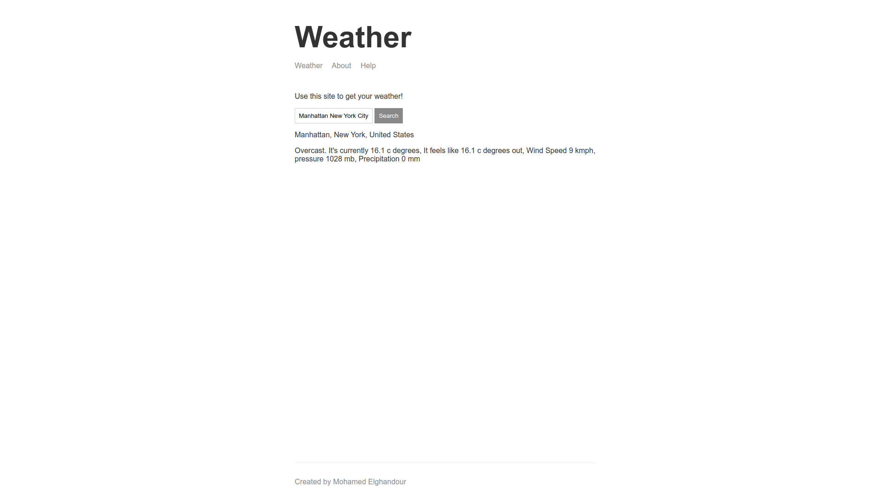

# Getting Started with Weather App

## Available Live Demo

Click [Here](https://weather-app-ghandour.herokuapp.com/) to View the Production.
Server

### weather

[](https://weather-app-ghandour.herokuapp.com/)

### about

[](https://weather-app-ghandour.herokuapp.com/about)

## Setup

Get the code:

```
git clone https://github.com/MohamedElGhandour/weather-app-learning-nodejs.git
```

Install dependencies:

```
cd weather-app-learning-nodejs
npm install
```

Run the server:

```
npm start
```

Run the server (dev mode):

```
npm run dev
```

Point a web browser at the demo:

```
http://localhost:3000
```
